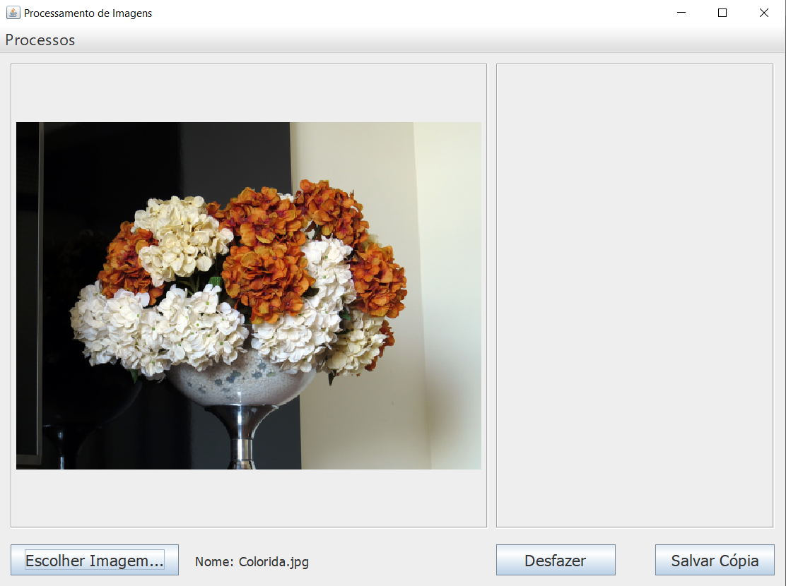

# Processamento-de-Imagem

Programa feito com fins avaliativos para a matéria de Processamento de Imagens.

Funcionalidades:
  - Tons de Cinza Médio e Ponderado.
  - Thresholding.
  - Negativa.
  - Soma Média de Imagens.
  - Soma Ponderada de Imagens.
  - Subitração de Imagens.
  - Pontos Salientes.
  - Dilatação e Erosão.
  - Abertura e Fechamento.
  - Operador de Roberts, Sobel e Robinson.

## Preview:

